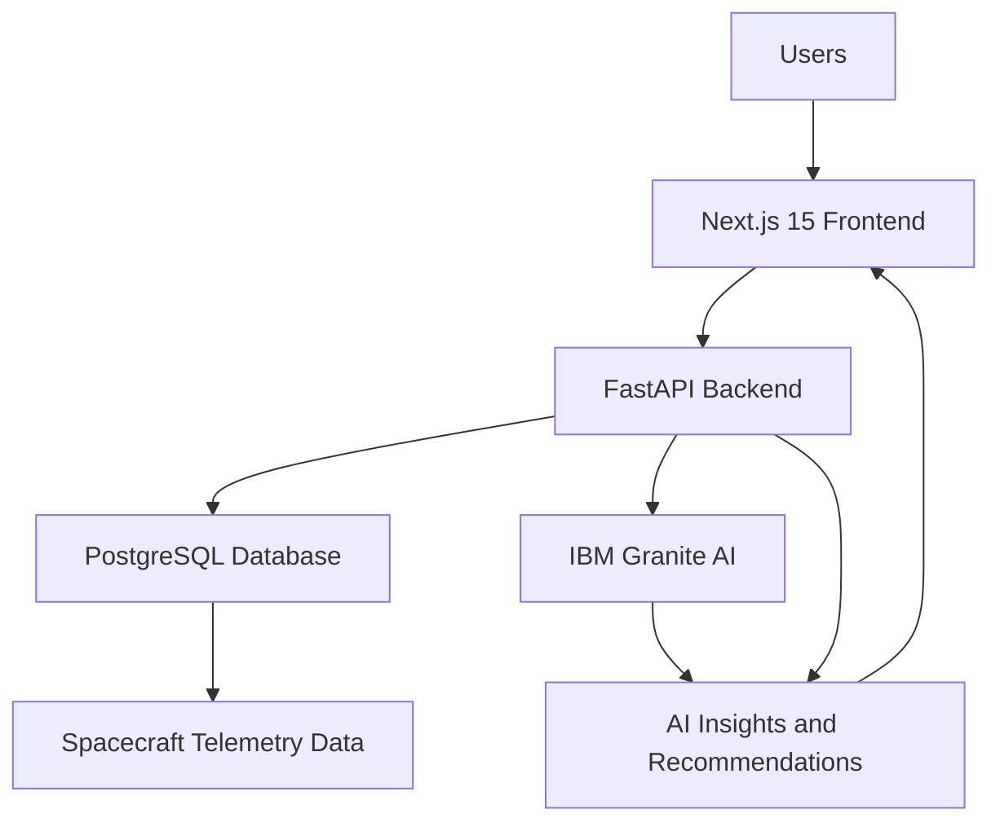

# MissionInsights AI Architecture

## System Overview

MissionInsights AI uses a full-stack architecture that combines a modern web interface, backend data processing, AI analysis, and a relational database.

The system receives spacecraft telemetry data, analyzes it using AI-powered services, detects anomalies, and presents mission insights through an interactive dashboard.

---

# Architecture Diagram

---
# Technology Stack

## Frontend

Technology:
- Next.js 15
- TypeScript
- Tailwind CSS
- Recharts

Purpose:
- User interface
- Telemetry visualization
- Mission dashboards
- AI interaction interface

---

## Backend

Technology:
- Python
- FastAPI

Purpose:
- Process telemetry data
- Run analysis workflows
- Provide APIs
- Connect AI services

---

## Database

Technology:
- PostgreSQL

Purpose:
- Store missions
- Store telemetry records
- Store anomaly results
- Store AI-generated reports

---

## Artificial Intelligence

Technology:
- IBM Granite
- AI-assisted development with IBM Bob

Purpose:
- Generate mission summaries
- Explain anomalies
- Provide recommendations
- Support Mission Commander assistant

---

# Core System Flow

1. Spacecraft telemetry data is collected.
2. Data is stored in PostgreSQL.
3. Backend services analyze telemetry patterns.
4. AI models identify unusual conditions.
5. IBM Granite generates understandable explanations.
6. Users view insights through the Next.js dashboard.

---

# Main Components

## Telemetry Dashboard

Displays:
- Battery status
- Fuel levels
- Temperature
- Signal strength
- Thruster performance

---

## AI Anomaly Detection

Analyzes telemetry patterns and identifies:

- System irregularities
- Potential failures
- Risk levels

---

## Mission Commander AI

Allows users to ask questions:

Example:
"What is the current spacecraft risk?"

The AI responds using available mission data.

---

## AI Mission Reports

Generates:

- Mission health summaries
- Risk explanations
- Recommended actions
