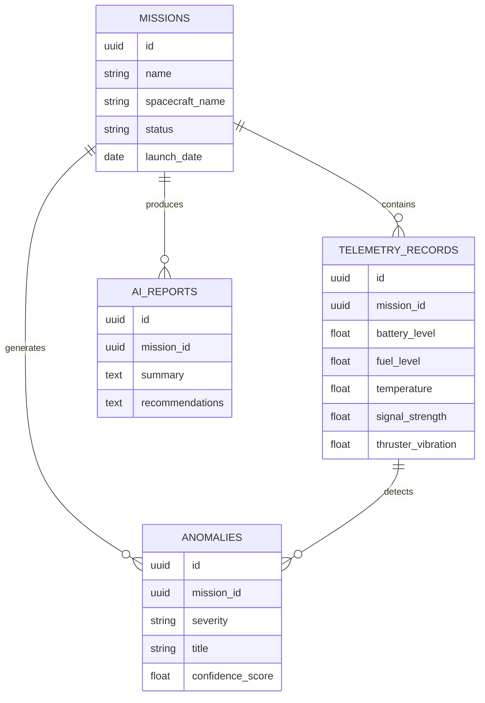

# MissionInsights AI Database Schema

## Overview

MissionInsights AI uses PostgreSQL to store spacecraft mission information, telemetry data, detected anomalies, and AI-generated mission insights.

The database supports spacecraft monitoring, anomaly detection, predictive analysis, and AI-powered decision support.

---

# Database Tables

## 1. missions

Stores information about spacecraft missions.

| Field | Type | Description |
|---|---|---|
| id | UUID | Unique mission identifier |
| name | VARCHAR | Mission name |
| spacecraft_name | VARCHAR | Spacecraft identifier |
| status | VARCHAR | Current mission status |
| launch_date | DATE | Mission launch date |
| created_at | TIMESTAMP | Record creation time |

Purpose:

Stores the basic information about each spacecraft mission being monitored.

---

## 2. telemetry_records

Stores spacecraft sensor readings collected over time.

| Field | Type | Description |
|---|---|---|
| id | UUID | Unique telemetry record identifier |
| mission_id | UUID | Related mission identifier |
| timestamp | TIMESTAMP | Time data was collected |
| battery_level | FLOAT | Battery percentage |
| fuel_level | FLOAT | Remaining fuel percentage |
| temperature | FLOAT | System temperature |
| signal_strength | FLOAT | Communication signal quality |
| thruster_vibration | FLOAT | Thruster vibration measurement |

Purpose:

Stores continuous spacecraft health data used by AI models for monitoring and anomaly detection.

---

## 3. anomalies

Stores detected spacecraft issues identified through AI analysis.

| Field | Type | Description |
|---|---|---|
| id | UUID | Unique anomaly identifier |
| mission_id | UUID | Related mission identifier |
| telemetry_id | UUID | Related telemetry record |
| severity | VARCHAR | Risk level |
| title | VARCHAR | Anomaly name |
| description | TEXT | Explanation of the detected issue |
| confidence_score | FLOAT | AI confidence percentage |
| created_at | TIMESTAMP | Detection time |

Purpose:

Stores abnormal conditions detected from spacecraft telemetry data.

---

## 4. ai_reports

Stores AI-generated mission summaries and recommendations.

| Field | Type | Description |
|---|---|---|
| id | UUID | Unique report identifier |
| mission_id | UUID | Related mission identifier |
| summary | TEXT | AI-generated mission summary |
| recommendations | TEXT | Suggested actions |
| created_at | TIMESTAMP | Report creation time |

Purpose:

Stores natural-language insights generated by IBM Granite AI.

---

# Database Relationships



---

# Sample Data Flow

## Mission Record

```json
{
  "mission": "Artemis Explorer",
  "spacecraft": "AE-01",
  "status": "Active"
}
```

---

## Telemetry Record

```json
{
  "battery_level": 87,
  "fuel_level": 65,
  "temperature": 29,
  "signal_strength": 96,
  "thruster_vibration": 0.15
}
```

---

## AI Anomaly Detection Result

```json
{
  "severity": "High",
  "issue": "Thruster vibration increasing",
  "confidence_score": 92
}
```

---

# Data Processing Flow

```text
Spacecraft Telemetry Data

        ↓

PostgreSQL Database

        ↓

AI Analysis Engine

        ↓

Anomaly Detection

        ↓

IBM Granite AI Explanation

        ↓

Mission Insights Report
```

---

# Future Improvements

Possible future database additions:

- User authentication
- Multiple mission operators
- Real NASA telemetry integration
- Historical mission knowledge database
- Vector database for AI retrieval
- Advanced machine learning models
